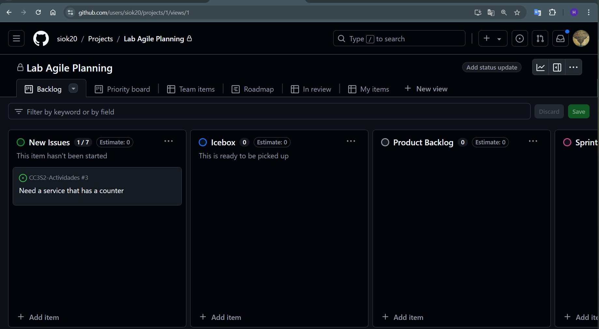
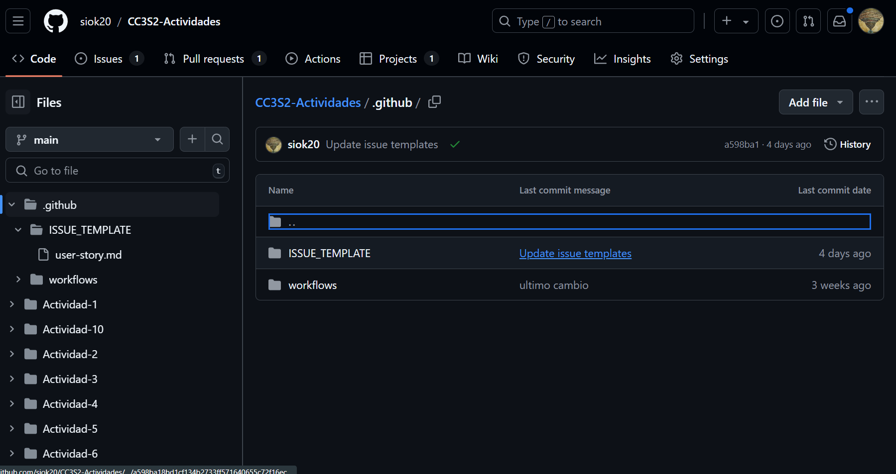
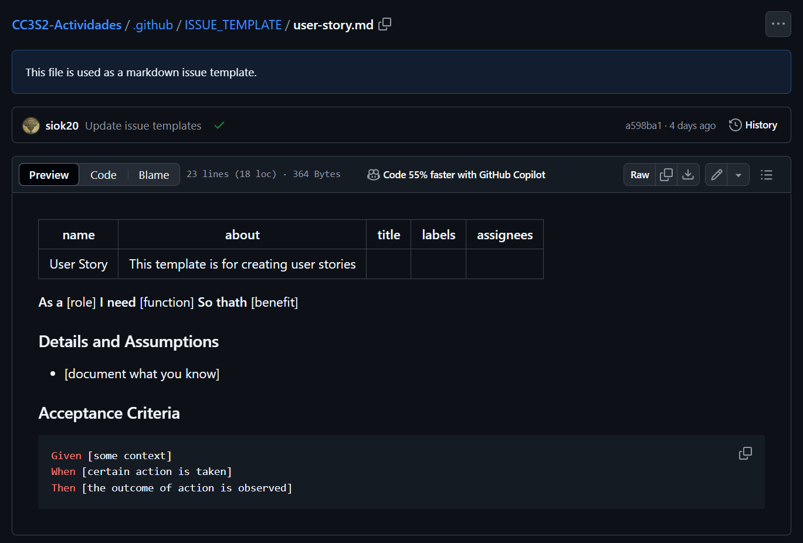
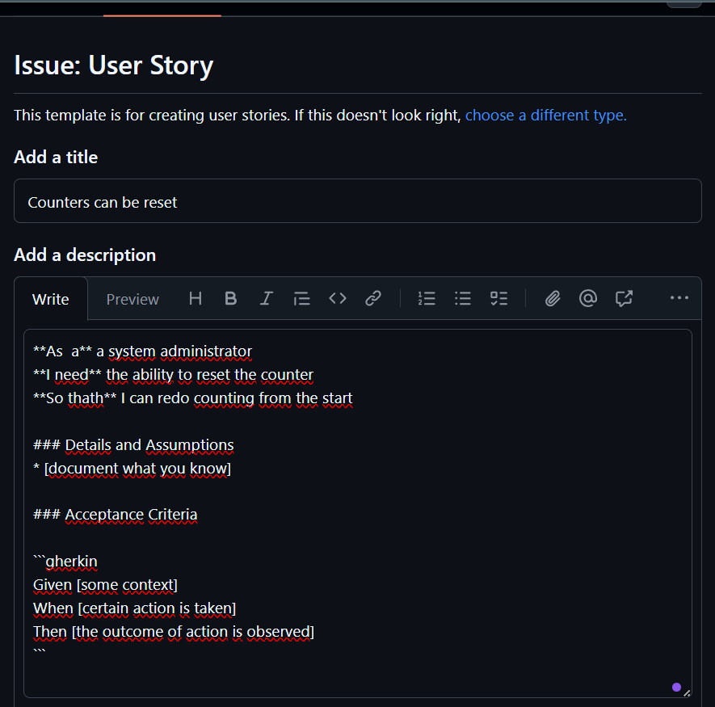
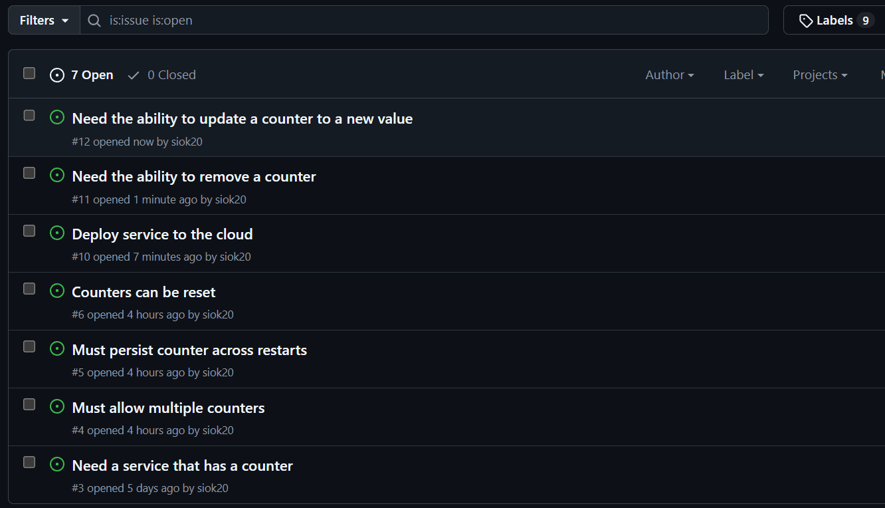
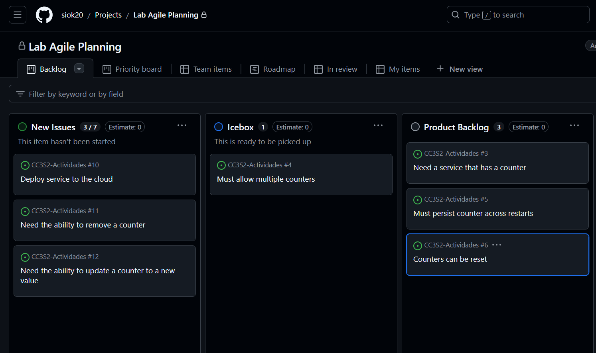
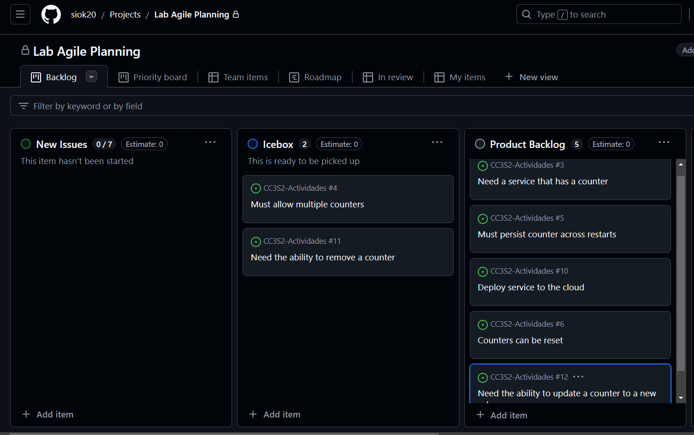
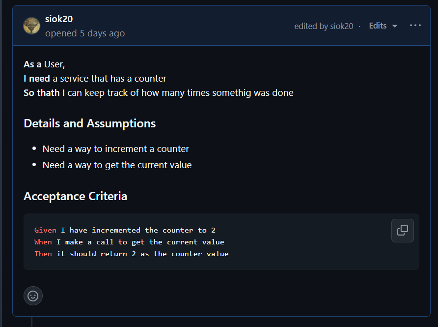
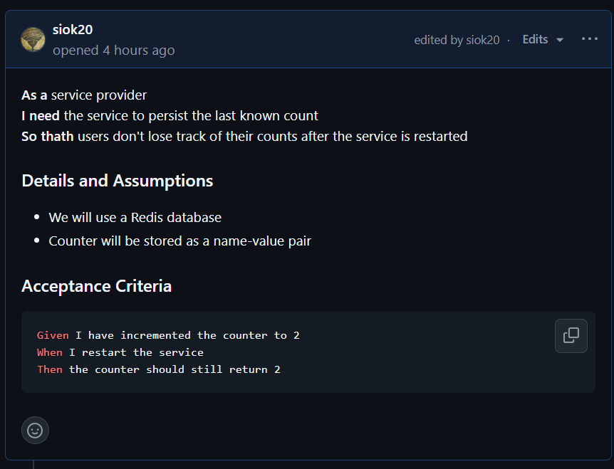
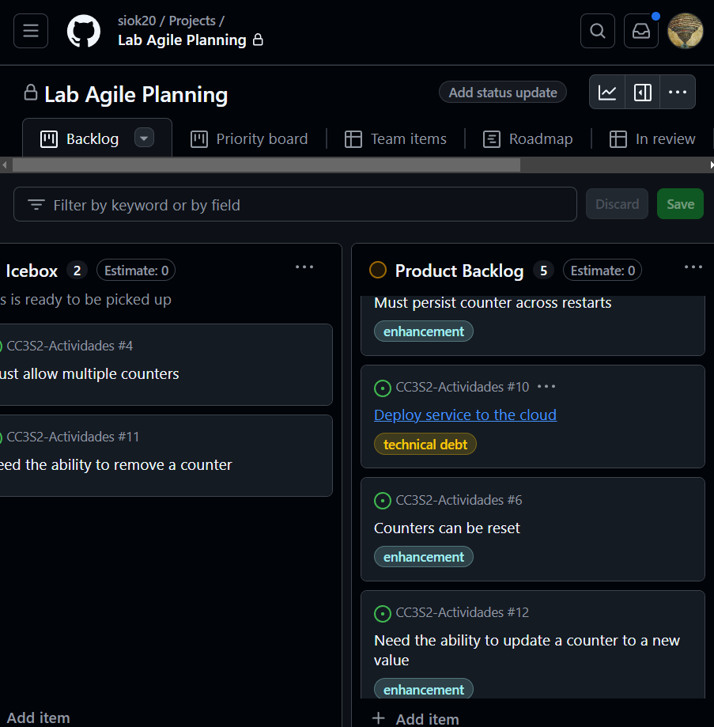

# Creacion del Kanban Board

# Creación del Issue Template 

## New Issues

#  
# 

# Priorizar  el product backlog

# Parte 4
 
## Triage

## Historias listas para el sprint

## Add new labels

