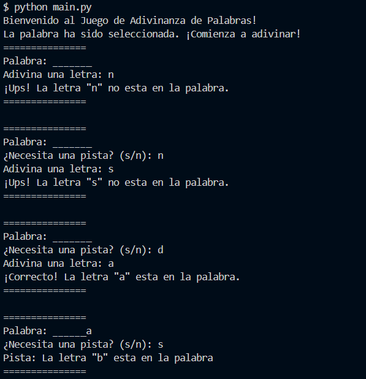
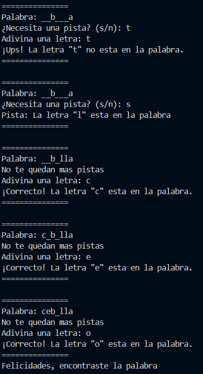

# Actividad 9 
# Desarrollo Ágil de un Juego de Adivinanza de Palabras Utilizando BDD y Control de  Versiones

## El juego
El jugador debe de adivinar una palabra secreta letra por letra, se mostrará el progreso del jugador, letras correctamente adivinadas y faltantes. 

## Ejecutar
Primero clona el repositorio

```bash
git clone https://github.com/siok20/CC3S2-Actividades.git
```
Acceda a la carpeta y corra el archivo principal

```bash
cd Actividad-9
python main.py
```

## Futuras funcionalidades
Se añadirán funcionalidades como selección aleatoria de palabras, sistema de pistas limitadas y control de intento de fallos

## Segundo Sprint
Se creó una clase `game` dentro de la carpeta `/src` que contiene toda la logica del juego

El archivo `main.py` ejecuta la clase `game` para inicializar un juego

Dentro de `game.py` se inicializa el juego eligiendo la palabra a buscar y empieza el juego, consultando sobre dar pistas y la letra que se adivina. Finalmente, cuando la palabra fue adivinada el juego se cierra.

## Game



Añadir la funcion de intentos, vistorias y errotas


