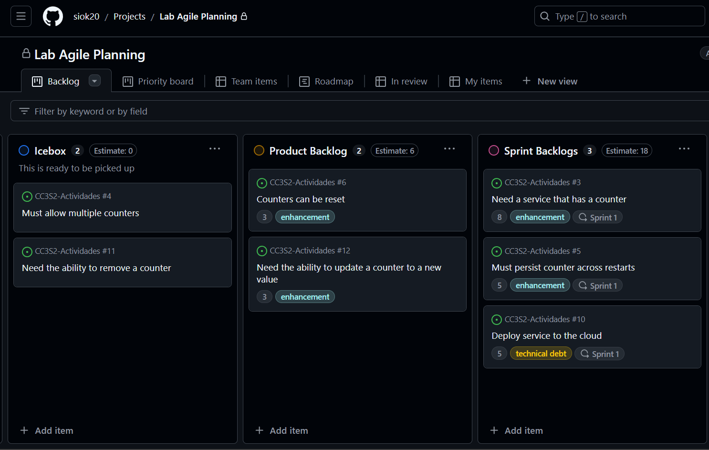
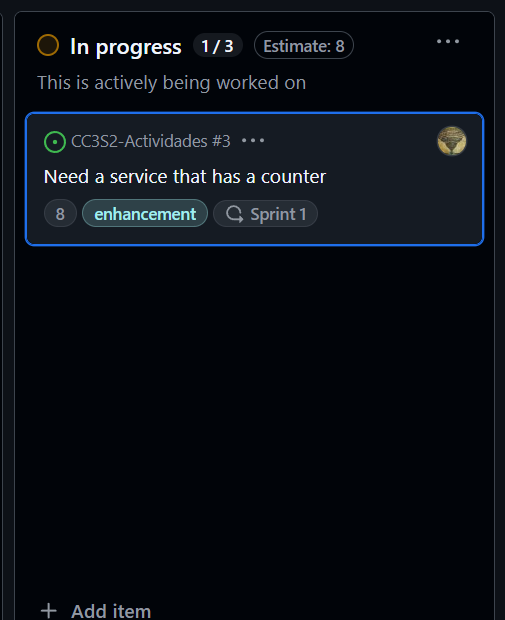
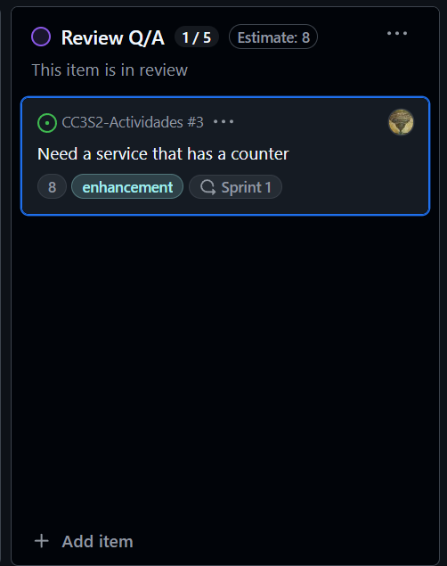
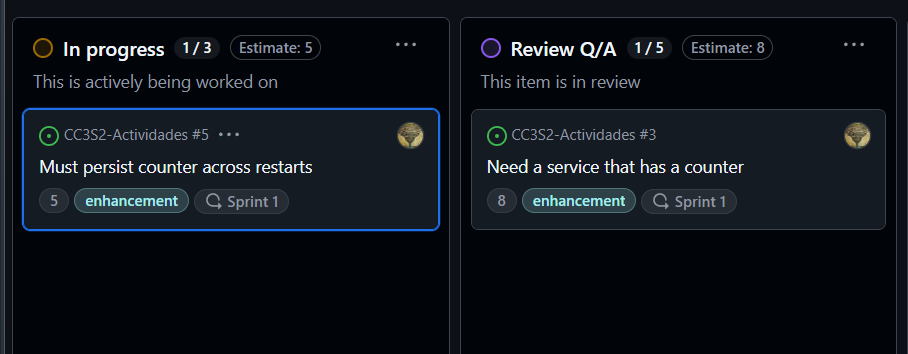
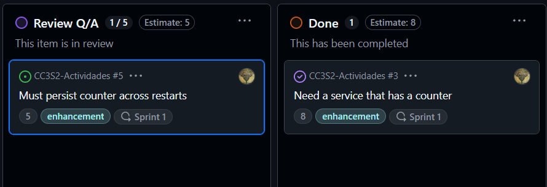
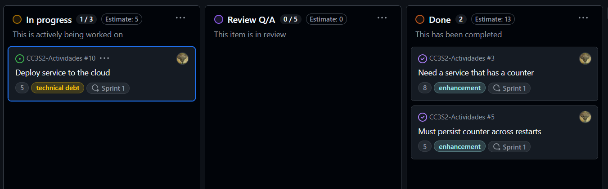
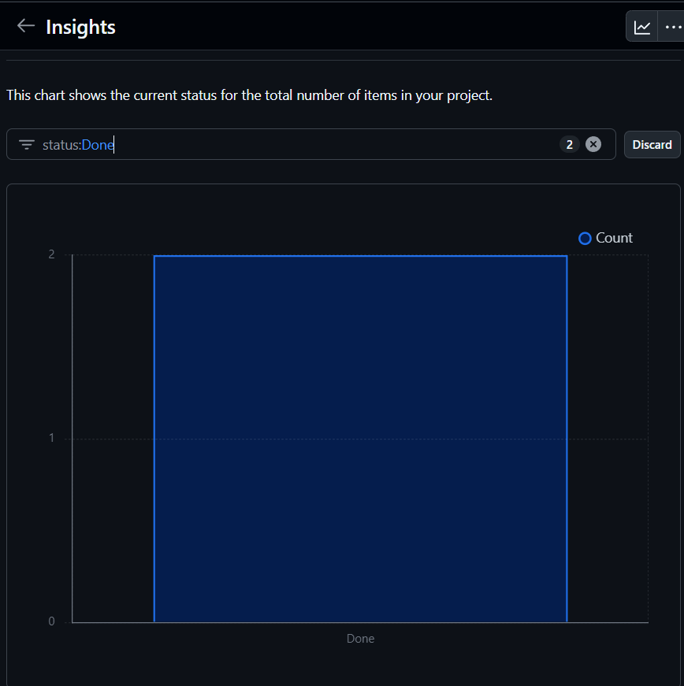
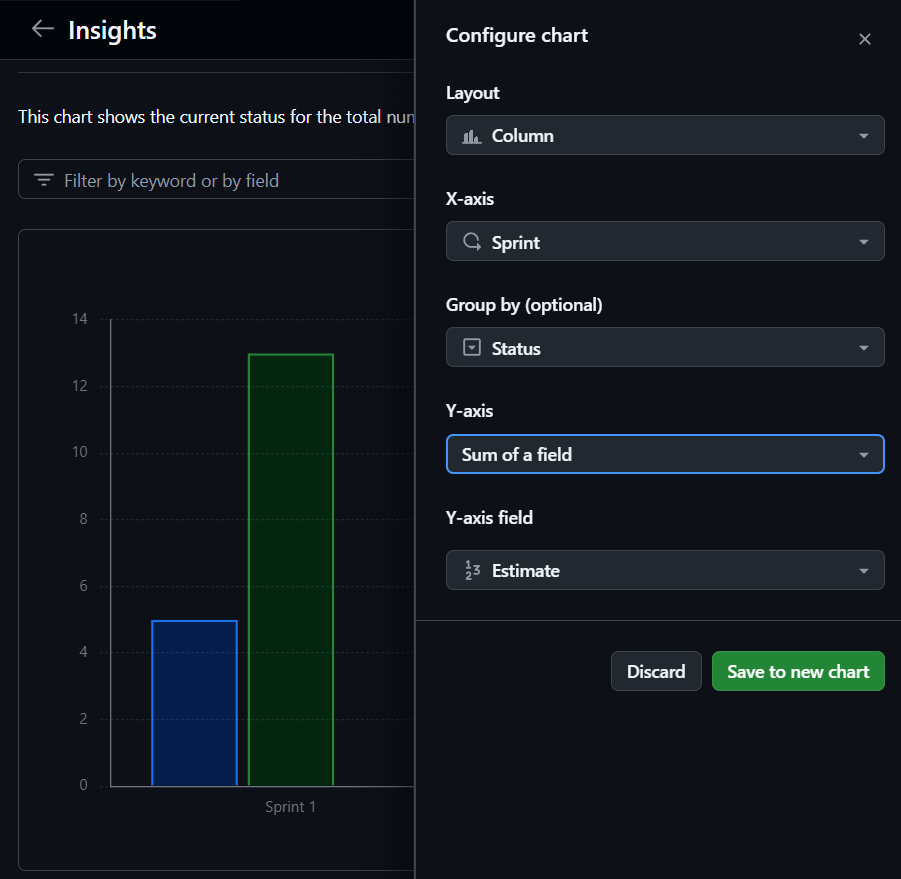
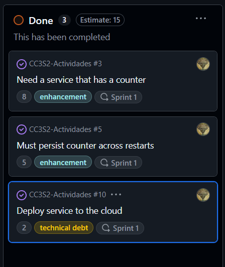
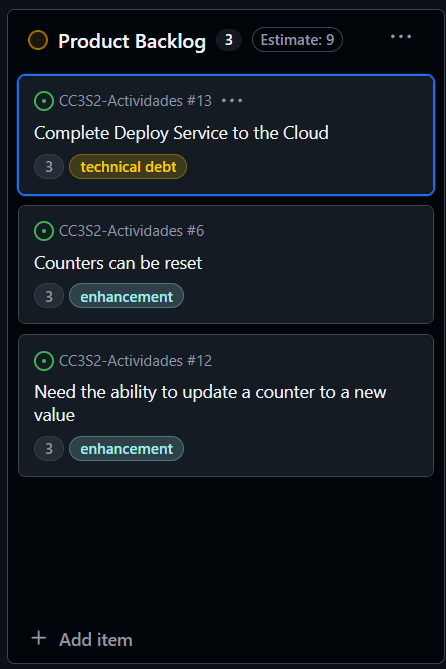

# Actividad 8

## Create a Sprint

## Flujo de trabajo diario
Simular el flujo de trabajo diario de un desarrollador en un equipo Agile

Me asigno a mi mismo a una tarea que considero puedo realizar.

Se solicita una revisión

Me considero con la capacidad de realizar otra tarea y me la asigno

Mi pull request ha sido aprobado entonces mi primera historia ha sido aprobada y el pull request de mi segunda historia entra en revisión

Me asigno la última historia, mientras que la revisión de mi segunda historia quedó completada.

Me quedé sin tiempo para terminar la historia, queda pendiente para el próximo Sprint

## Configuracion de Burndown Chart

Filtrar el burdown chart para las historias concluidas

Configurar el burdown chart para visualizar las historias por status de un Sprint

## Gestionar el trabajo incompleto

La historia inconclusa solo gastó 2 story points así que finaliza lo realizado hasta ese Sprint

Añadir el trabajo restante a una nueva historia

